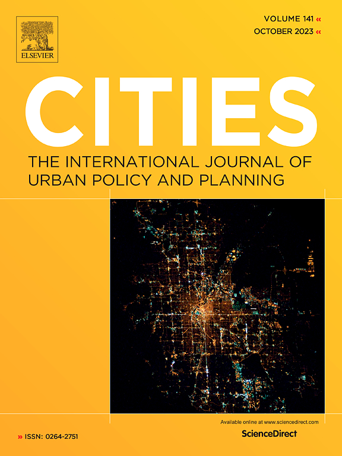

# Ride-hailing and transit accessibility considering the trade-off between time and money 

This repository contains the code used to write the study:

- Pereira, R. H. M.; Herszenhut, D.; Saraiva, M.; Farber, S. (2024). **Ride-hailing and transit accessibility considering the trade-off between time and money**. *Cities*, 144, 104663. [https://doi.org/10.1016/j.cities.2023.104663](https://doi.org/10.1016/j.cities.2023.104663)

  - [Ungated PDF of the paper available here](https://www.urbandemographics.org/publication/2024_Cities_ride_hailing_access_rio).

